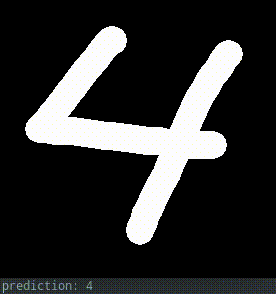

# mnist-interactive-recognizer

`main.py` will:

1. download the MNIST database
2. train and test a [CNN](http://ufldl.stanford.edu/tutorial/supervised/ConvolutionalNeuralNetwork/) or a fully connected network
3. open a drawing window
4. try to recognize the number that the user has written:

## Deps:

* [NumPy](https://numpy.org/)
* [PyTorch](https://pytorch.org/)
* [torchvision](https://pytorch.org/docs/stable/torchvision/index.html)
* [Pygame](https://www.pygame.org/)

## To Do:

 * ~~CNN~~
 * save and load trained model
